# How to Configure an "API Call" Action (Step-by-Step)

This guide walks through configuring the built-in **API Call** action on a form
component, using a button that creates a `Person` record as the worked example.
It follows the actual Form Designer UI, step by step.

## Step 1: Create a test button and select the API Call action

1. Drag a **Button** component onto your form — a throwaway/test button is fine
   for trying this out.
2. Open the button's **On Click** action configuration.
3. From the action dropdown, select **Common: API Call**.


Selecting this expands an **Arguments** panel, which is where the rest of the
configuration happens.

## Step 2: Choose the HTTP verb and endpoint URL

In the **Arguments** panel:

1. Set **HTTP Verb** to the verb your endpoint expects (GET, DELETE, HEAD,
   OPTIONS, PUT, PATCH, PURGE, LINK, POST, ...).
    - For this example, select **POST**, since we're creating a new Person.
2. Set **URL** to the endpoint you want to call. For creating a Person via
   Shesha's dynamic CRUD endpoint:

```
/api/dynamic/Shesha/Person/Crud/Create
```

This works the same way for any endpoint that accepts parameters — pick
whichever verb/URL combination matches the endpoint you're targeting.

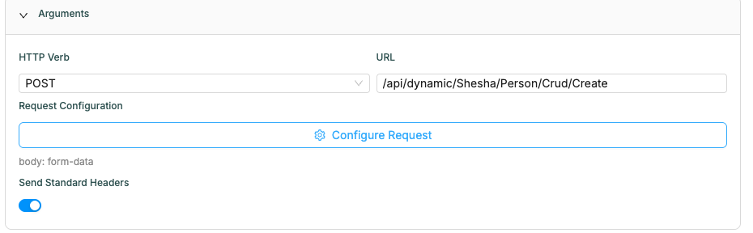

## Step 3: Configure the request payload

Click **Configure Request** to open the request configuration dialog. This is
where you define what actually gets sent with the call — parameters, headers,
and body.

### Add the parameters to send

1. In the **Configure Request** dialog, add each parameter you want to send to
   the endpoint by clicking **Add Parameter**.
2. Give each parameter a **key** and a **value** (values can reference form
   data, e.g. a field bound to `data.firstName`).
3. Click **OK** to save.

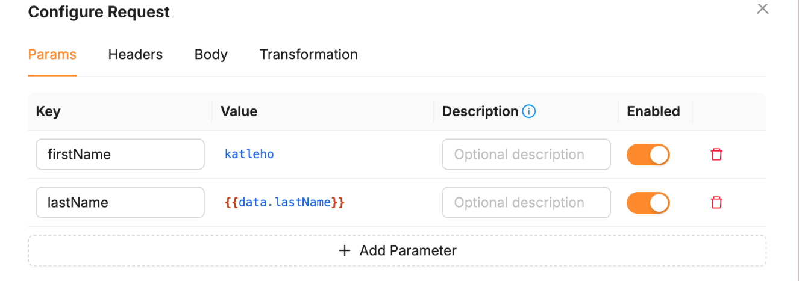

Back on the action configuration panel, you'll see a summary (e.g.
`body: form-data`) confirming what was configured. When the button is clicked,
these parameters are sent along with the call to the endpoint from Step 2.

## Step 4: Configure headers on an endpoint that expects them

`Send Standard Headers` covers the common case — it attaches the current user's
`Authorization: Bearer {token}` automatically when calling your own backend
(this is the same Bearer scheme the Shesha API itself defines for
authentication). **It's on by default** for every new API Call action, so most
of the time there's nothing to configure here at all — you only need to touch
it, or add headers manually via the **Headers** tab in the **Configure
Request** dialog, in the two cases below:

- **Calling an external API with its own auth scheme.** For example, an
  address-verification or ID-lookup service you're calling from a "Verify
  address" button on the Person form. `Send Standard Headers` must be **off**
  here (you never send your app's session token to a third party), and
  instead you add the header the external service actually requires:

    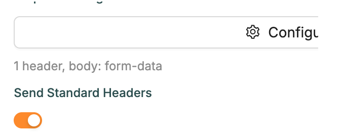

    (or `Authorization: Bearer <their-token>`, `Ocp-Apim-Subscription-Key`, etc.
    — whatever that specific external API documents.)

- **Calling your own backend without the current user's session** — e.g. from
  a public/anonymous form where there's no logged-in user, but the endpoint
  still requires a token (a service account token, for instance):

    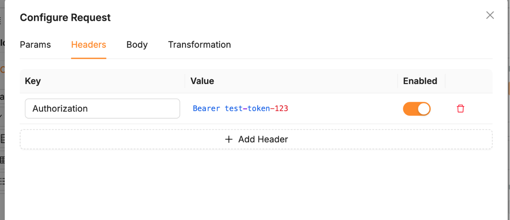

To add one: open **Configure Request** → **Headers** tab → **Add Header** →
fill in **key** and **value** → **OK**. Just like parameters, a header's value
can reference form/context data (e.g. a token stored earlier in page context)
rather than being hard-coded.

### Try it yourself: testing an auth header (Bearer token)

The address-verification/API-key example above is realistic, but you
probably don't have a service like that handy to actually test against.
[httpbin.org](https://httpbin.org) is a free public test service built
for exactly this — no signup, no risk to real data, just point an action
at it. `GET https://httpbin.org/bearer` checks for an
`Authorization: Bearer <token>` header and tells you plainly whether it
saw a valid one:

1. HTTP Verb **GET**, URL `https://httpbin.org/bearer` — the `https://`
   is required here, since a bare `httpbin.org/bearer` would be treated
   as a relative path and sent to your own backend instead of httpbin.
2. **Send Standard Headers**: off (it's an external API — there's no
   reason to send your app's own session token to it).
3. **Configure Request** → **Headers** tab → add:

    | Key | Value |
    |---|---|
    | `Authorization` | `Bearer test-token-123` |

4. Run it → `200 OK`:

    ```json
    { "authenticated": true, "token": "test-token-123" }
    ```

5. Now disable that header row (or clear its value) and run the same
   action again → `401 Unauthorized`. That confirms the header — not
   something else — was what made step 4 succeed.

Want to see the *entire* header set an action actually sends, e.g. to
check what `Send Standard Headers` adds when you flip it back on? Point
the same action at `GET https://httpbin.org/headers` instead — it echoes
back every header it received, verbatim.

### Try it yourself: testing a conditional header (ETag)

Most Shesha endpoints don't branch on custom headers, but the built-in file
endpoint genuinely does — it's a good one to practice on because you can
directly see the response change.

`Person.Photo` is a `StoredFile`. Using the file id from a Person's photo:

1. **First call** — GET, URL `/api/StoredFile/Download`, parameter
   `id = <the file id>`, **no** headers. Run it → you get `200 OK`, the file
   content, and a response `ETag` header equal to the file version's GUID.
2. **Second call** — same action, but on the **Headers** tab add:

    | Key | Value |
    |---|---|
    | `If-None-Match` | `<the ETag value from step 1's response>` |

    Run it again → you get `304 Not Modified` with no body, because the header
    told the server "I already have this exact version."

This is implemented in
`shesha-core/src/Shesha.Application/StoredFiles/StoredFileController.cs`
(`DownloadAsync`) — useful to see because it's a real conditional-header code
path in this codebase, not a hypothetical one.

---

## Step 5: Configure the request body

The **Configure Request** dialog has four tabs: **Params**, **Headers**,
**Body**, **Transformation**. The **Body** tab controls what payload (if any)
gets sent, and offers five options:

- **none** — no payload is sent with the request at all.

- **JSON** — write the payload directly in a JSON editor. Values can be
  hard-coded or reference form data via a Mustache expression, e.g.

    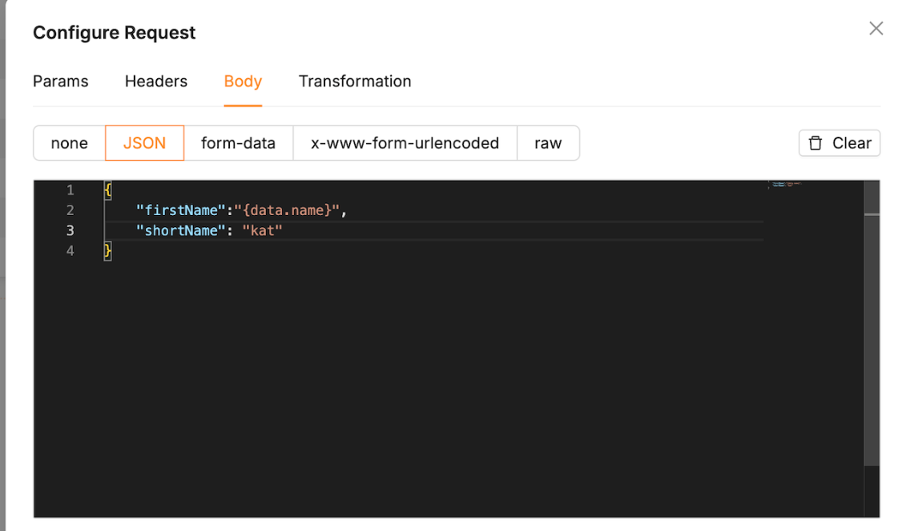

    Once you click **OK** and trigger the button, open your browser's DevTools
    → **Network** tab and inspect the request — you'll see exactly the payload
    you configured going out on the wire.

- **form-data** — instead of hand-writing JSON, add fields one at a time via
  **Add Field**. The **Key** column autocompletes against your form's data
  properties (e.g. typing `fir` suggests `FirstName`), and **Value** accepts
  either a literal value or a `{{expression}}` referencing form data:

    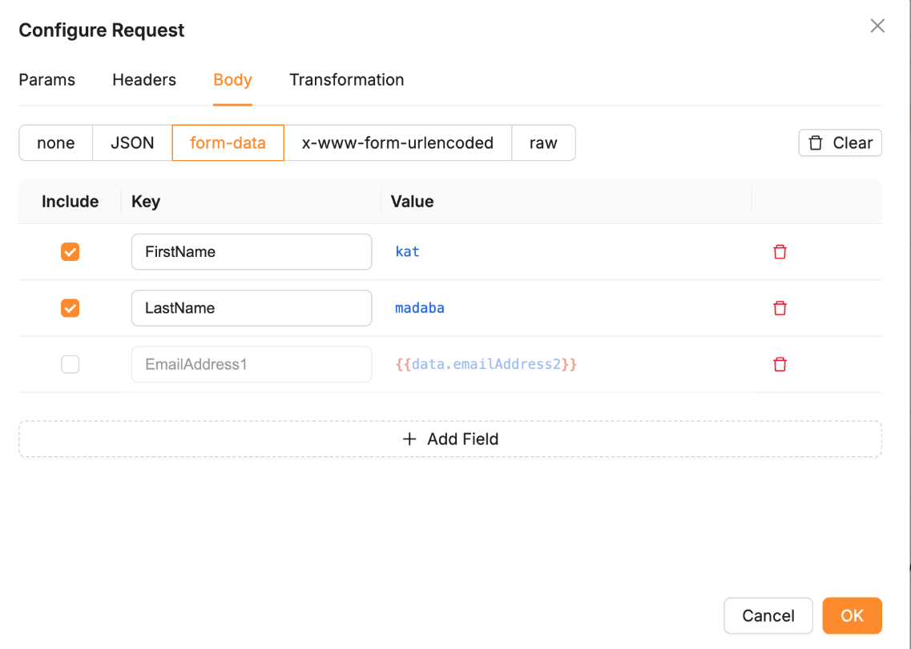

    The **Include** checkbox on the left lets you toggle a field on or off
    without deleting it — handy for testing different combinations of fields.
    Only checked rows are actually sent. Click **OK** to save.

    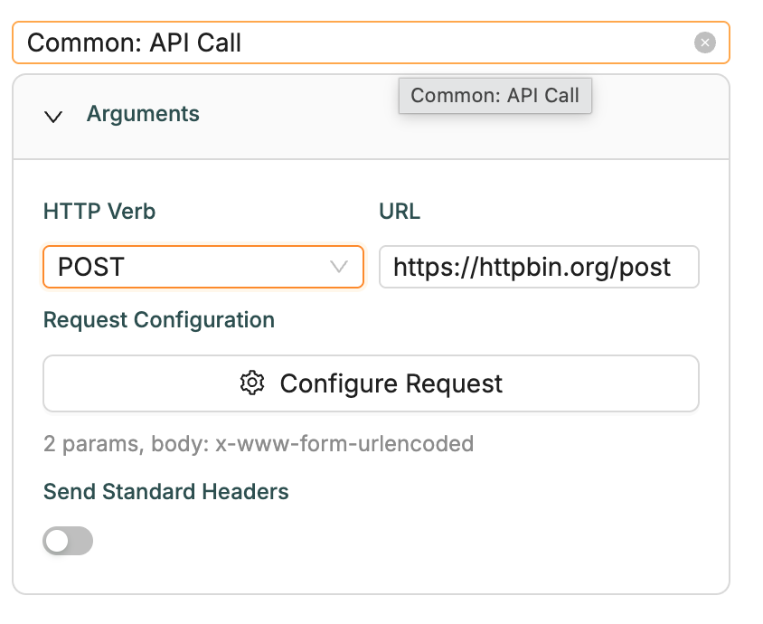

- **x-www-form-urlencoded** — the same field-list UI as form-data, but sent
  as a URL-encoded form body instead of multipart.

- **raw** — write a raw string body, with a sub-type of `text`, `json`,
  `xml`, or `html` (Mustache-evaluated), or `javascript` — where instead of a
  static value, you write a script whose return value becomes the payload.

> **Note:** none of Shesha's own dynamic CRUD/app-service endpoints accept
> `x-www-form-urlencoded` or `raw` bodies right now — they expect JSON.
> To practice these two body types, point the action at an **external
> API** that actually accepts that format (e.g. a public test endpoint
> like `https://httpbin.org/post`, or a third-party service that
> documents `x-www-form-urlencoded`/raw support) rather than a Shesha
> endpoint in this codebase. The equivalent call on the command line is:
>
> ```bash
> curl -X POST https://httpbin.org/post \
>   -H "Content-Type: application/x-www-form-urlencoded" \
>   --data "username=john&email=john@example.com"
> ```

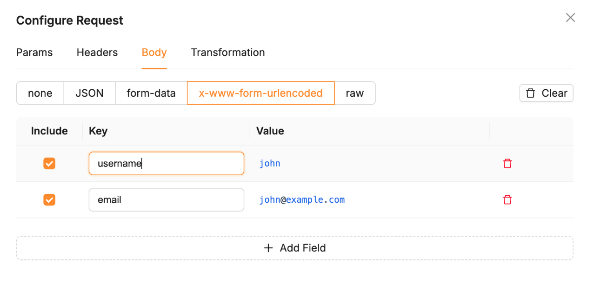

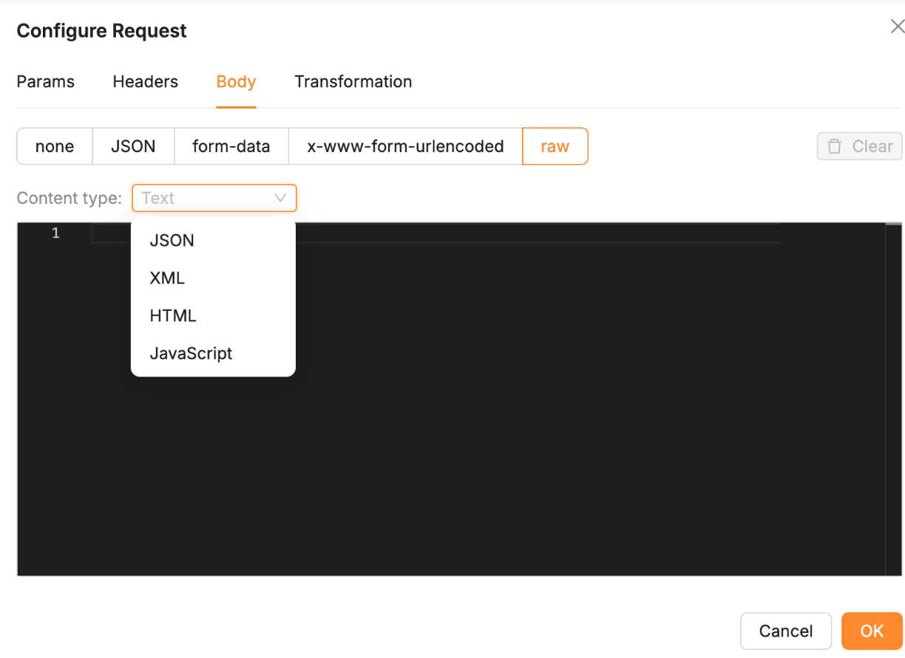

### Understanding the `raw` body type

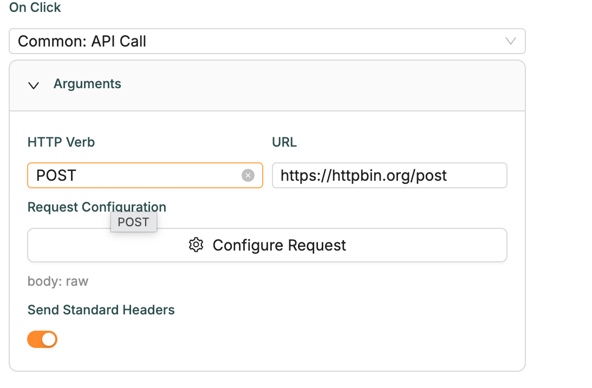

`raw` is different from the other options — instead of a structured,
field-based format (form-data's key/value rows, or JSON's fixed structure),
it sends the body as a plain string you fully control. Picking `raw` gives
you a **sub-type** selector: `text`, `json`, `xml`, `html`, or `javascript`.
That sub-type changes how the content you type is treated:

- **`text` / `json` / `xml` / `html`** — the content is a **static template**.
  It's run through the same Mustache evaluation as everywhere else (so
  `{{data.firstName}}` gets replaced with real form data), then sent as-is.
  The `Content-Type` header is set to match automatically
  (`text/plain`, `application/json`, `application/xml`, `text/html`
  respectively) unless you've already set your own `Content-Type` on the
  Headers tab. This is handy when the JSON body tab's structured editor is
  too rigid — e.g. sending XML/HTML, or hand-assembling a JSON string with
  parts that don't map cleanly to fields.

    **Try it yourself:** HTTP Verb **POST**, URL `https://httpbin.org/post`,
    Body tab → `raw` → sub-type **xml**:

    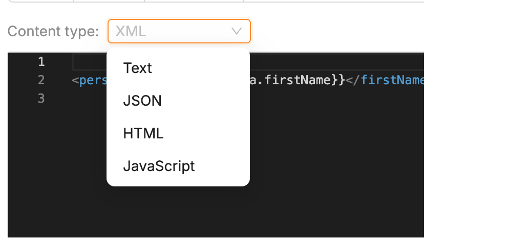

    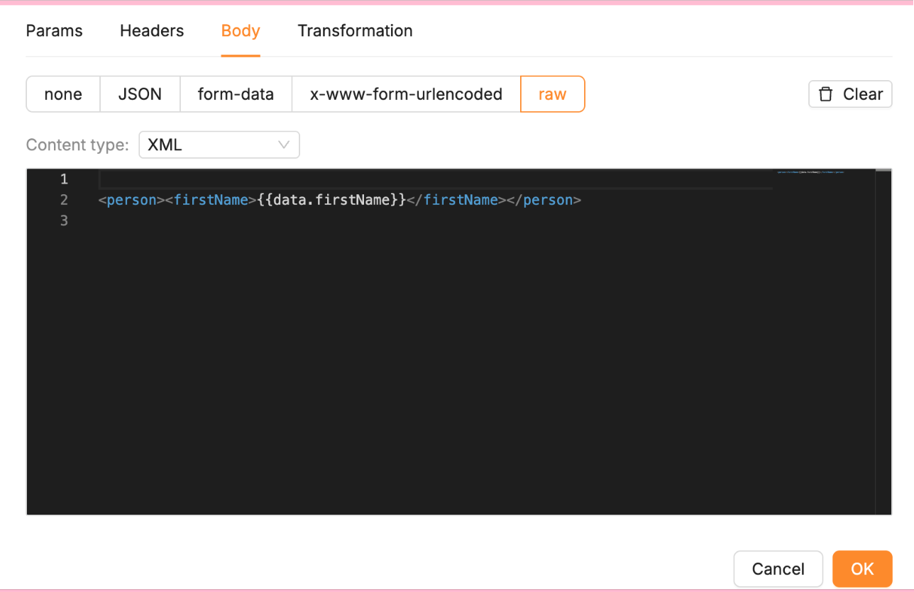

    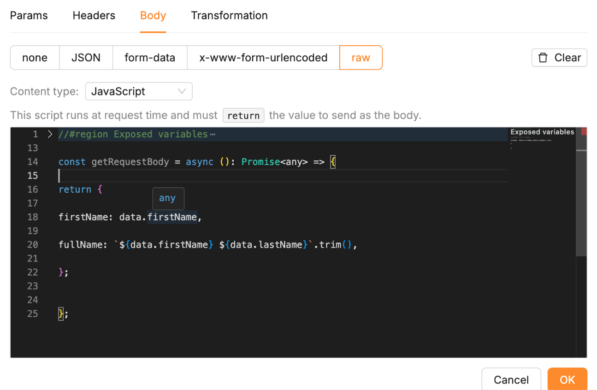

    Run it → httpbin's response includes a `"data"` key showing your Mustache
    already substituted with real form data (e.g.
    `<person><firstName>kat</firstName></person>`), and a `"headers"` key
    confirming `"Content-Type": "application/xml"` was set for you
    automatically — no manual header needed.

- **`javascript`** — the content isn't a template at all, it's a **script**.
  It runs against the same live context as any other script in the form
  (`data`, `form`, `application`, etc.), and whatever it `return`s becomes
  the request body. Return an object and it's serialized with
  `Content-Type: application/json` set automatically; return a string and
  that string is sent as-is.

    **Try it yourself:** same URL/verb as above, sub-type **javascript**:

    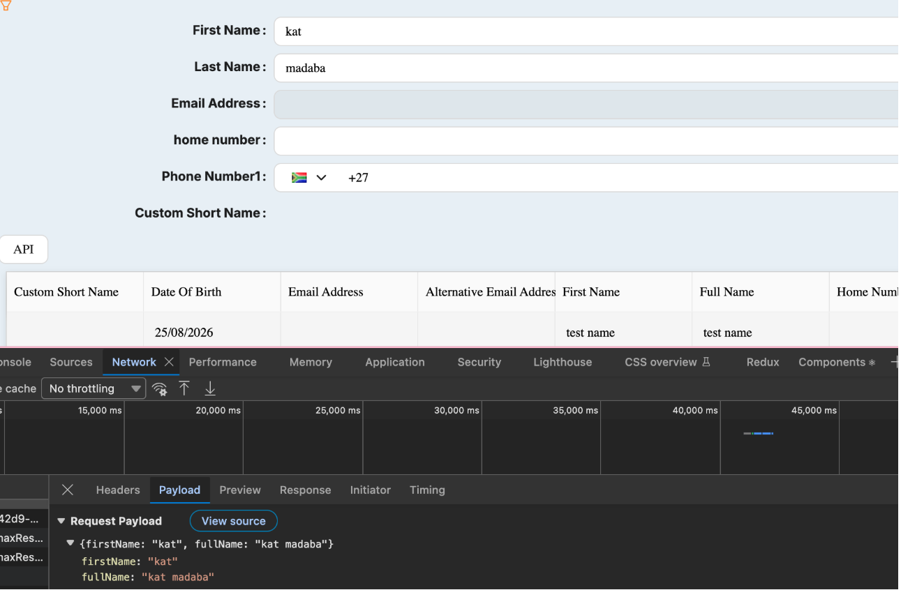

    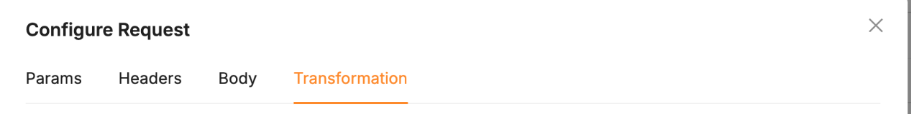

    Run it → httpbin's `"json"` key shows exactly the object your script
    returned (e.g. `{"firstName": "kat", "fullName": "kat madaba"}`), and
    `"headers"` confirms `Content-Type: application/json` — proof it's the
    script's *return value*, not a static string, that became the payload.

    This is the most flexible body option — reach for it when the payload
    needs conditional logic or computed values that a static template can't
    express.

Whichever type you pick, **Clear** (top-right of the Body tab) resets it back
to `none`. And as with Step 3, always check the Network tab after saving to
confirm the actual payload matches what you configured — this is the fastest
way to catch a mistyped expression or a field that didn't get included.

## Step 6: Transform the response

### What is "Transformation"?

The fourth tab in **Configure Request** — alongside Params, Headers, and
Body — is **Transformation**. Where the other three tabs shape the
**request** going out, Transformation reshapes the **response** coming back,
before anything else sees it.

There's no separate on/off switch — write a script in the tab's editor and it
runs automatically right after the call succeeds: the raw response (already
unwrapped from the backend's response envelope) is handed to your script as
`response`, along with the same globals every other script in the form gets
(`data`, `form`, `application`, etc.). Whatever your script `return`s
**replaces** the response — and that's the value everything downstream sees,
most importantly the `onSuccess` action's `actionResponse`.

If the script is left empty, or it throws an error, the original
untransformed response is passed through unchanged (an error is only logged
to the console) — so a bad script fails safe rather than breaking the call.

### Try it yourself: deriving an email address and writing it onto the form

Continuing the Person Create example from Step 2 — trigger it once with
the Transformation script still empty, then open your browser's DevTools
**Network** tab and look at the response body. Shesha's dynamic CRUD
endpoints wrap every response in an ABP envelope, so it looks like this:

```json
{
  "result": {
    "id": "74d14b7f-b8b7-416e-9e04-9025d2063360",
    "firstName": "kat",
    "lastName": "madaba",
    "emailAddress1": null,
    "…": "…"
  },
  "success": true,
  "error": null
}
```

**Important:** by the time your transformation script runs, this envelope
has already been unwrapped for you — `response` in the script *is*
`result` directly. Writing `response.data.firstName` (treating `response`
as if it were the raw envelope) is a common mistake, and throws, since
there's no `.data` layer at this point.

In the **Transformation** tab:

1. Write a script that both derives an email address *and* writes it
   straight onto the visible `emailAddress1` field:

    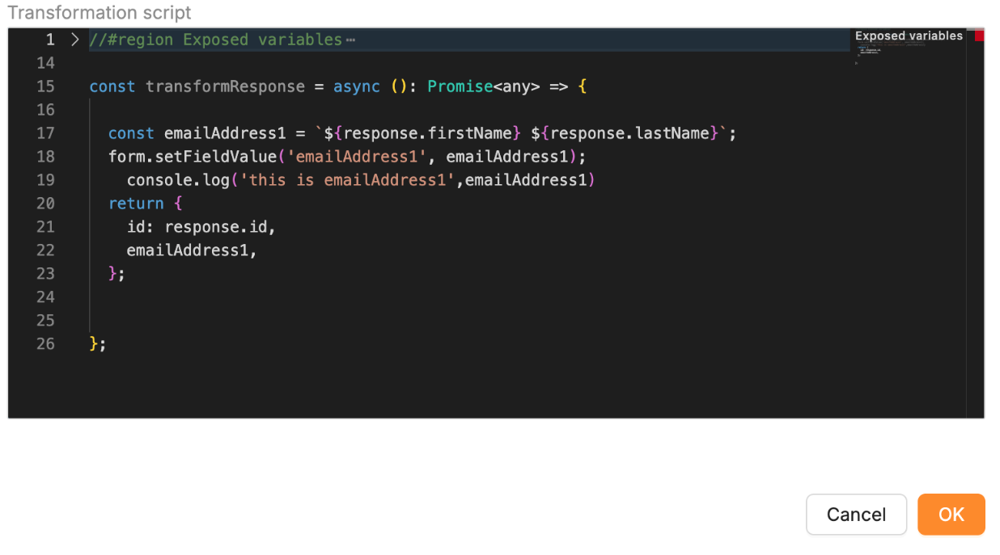

2. Click **OK**, then trigger the button.

Two things to check, and one thing *not* to expect:

- The `emailAddress1` field on the form should update immediately — that's
  `form.setFieldValue(...)` at work. If it doesn't, double-check that
  `'emailAddress1'` is the exact `propertyName` bound to that field (its
  label isn't enough, and a mismatch fails silently, with no error at all).
- Add a `console.log(...)` *after* the `form.setFieldValue(...)` line and
  it should print in DevTools. If it doesn't, the line above it threw —
  check the console for `Response transformation failed, returning
  original response: <reason>`, which names the actual failure.
- **The Network tab's response will still show the original, untransformed
  payload — that's expected, not a bug.** Transformation runs entirely in
  application memory, after the browser has already recorded what came
  over the wire; it only reshapes what flows onward to `actionResponse`
  (and whatever your script does as a side effect, like `setFieldValue`),
  never what DevTools shows actually happened on the network.

Returning a value still matters even when you're also using
`setFieldValue`: by the time `onSuccess` runs, `actionResponse.emailAddress1`
holds the same derived value — ready to reuse in a notification, a
follow-up API Call, or anywhere else that reads the action's result rather
than the form directly.

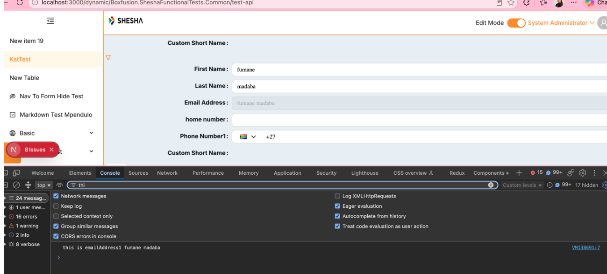

### A more realistic example: summarizing a list response

String concatenation is the simplest case, but Transformation is a real
script — it can filter, map over arrays, and compute values, not just
stitch two fields together. Take a "Check for duplicate" button that calls
`GET /api/dynamic/Shesha/Person/Crud/GetAll`. A dynamic CRUD list response
looks like:

```json
{
  "totalCount": 2,
  "items": [
    { "id": "…", "firstName": "Katleho", "lastName": "Madaba", "mobileNumber1": "0821234567", "emailAddress1": null },
    { "id": "…", "firstName": "Katleho", "lastName": "M", "mobileNumber1": null, "emailAddress1": "k.m@example.com" }
  ]
}
```

Rather than have `onSuccess` dig through `items`/`totalCount` itself, the
transformation script can boil that down into exactly what the rest of the
action needs:

```js
return {
  hasDuplicate: response.totalCount > 0,
  matches: (response.items ?? []).map((person) => ({
    id: person.id,
    fullName: [person.firstName, person.lastName].filter(Boolean).join(' '),
    contact: person.mobileNumber1 || person.emailAddress1 || 'No contact info on file',
  })),
};
```

What this is doing, line by line:

- `hasDuplicate` — a plain boolean, so `onSuccess` can just check
  `actionResponse.hasDuplicate` instead of comparing `totalCount` itself.
- `.map(...)` — reshapes every raw person record in the list into a small,
  purpose-built object, rather than passing the whole entity through.
- `.filter(Boolean).join(' ')` — safely builds a full name even if one of
  the name parts is missing, instead of producing `"Katleho undefined"`.
- `person.mobileNumber1 || person.emailAddress1 || '...'` — picks whichever
  contact detail actually exists, with a sensible fallback if neither does.

`onSuccess` then only ever has to deal with the clean shape
(`actionResponse.hasDuplicate`, `actionResponse.matches[i].fullName`, …)
instead of re-deriving the same logic in every action that consumes this
call.
